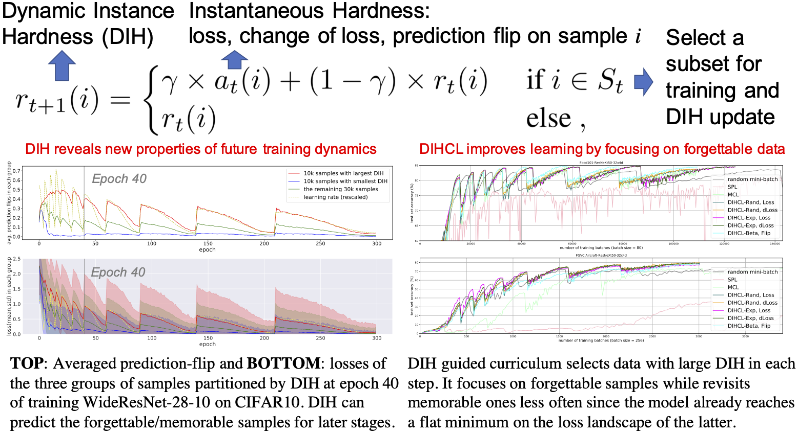

# Curriculum Learning by Dynamic Instance Hardness (DIHCL)
PyTorch Code for NeurIPS 2020 paper:\
<b>Title</b>: <i>Curriculum Learning by Dynamic Instance Hardness</i> <a href="./paper/dihcl_neurips2020_main.pdf">[pdf]</a>\
<b>Authors</b>:Tianyi Zhou, Shengjie Wang, Jeff A. Bilmes\
<b>Institute</b>: University of Washington, Seattle

<pre>
@inproceedings{
    zhou2020dihcl,
    title={Curriculum Learning by Dynamic Instance Hardness},
    author={Tianyi Zhou and Shengjie Wang and Jeff A. Bilmes},
    booktitle={Advances in Neural Information Processing Systems 34 (NeurIPS)},
    year={2020},
}</pre>

<b>Abstract</b>\
A good teacher can adjust the curriculum based on students' learning history. By analogy, in this paper, we study the dynamics of a deep neural network's (DNN) performance on individual samples during its learning process. The observed properties allow us to develop an adaptive curriculum that leads to faster learning of more accurate models. We introduce dynamic instance hardness (DIH), the exponential moving average of a sample's instantaneous hardness (e.g., a loss, or a change in outputs) over the training history. A low DIH indicates that a model retains knowledge about a sample over time, and implies a flat loss landscape for that sample. Moreover, for DNNs, we find that a sample's DIH early in training predicts its DIH in later stages. Hence, we can train a model using samples with higher DIH and safely ignore those with lower DIH. This motivates a DIH guided curriculum learning (DIHCL). Compared to existing CL methods: (1) DIH is more stable over time than using only instantaneous hardness, which is noisy due to stochastic training and DNN's non-smoothness; (2) DIHCL is computationally inexpensive since it uses only a byproduct of back-propagation and thus does not require extra inference. On 11 datasets, DIHCL significantly outperforms random mini-batch SGD and recent CL methods in terms of efficiency and final performance.

<b>Illustration</b>\

<b>License</b>\
This project is licensed under the terms of the MIT license.