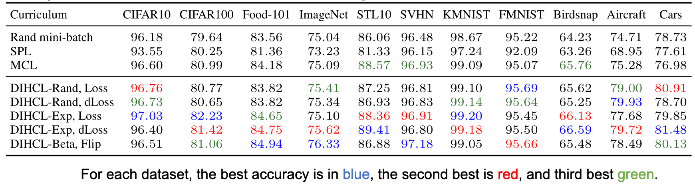

# Curriculum Learning by Dynamic Instance Hardness (DIHCL)

## NeurIPS 2020 paper:

<b>Title</b>: <i>Curriculum Learning by Dynamic Instance Hardness</i> <a href="./paper/dihcl_neurips2020_main.pdf">[pdf]</a> <a href="./paper/dihcl_neurips2020_appendix.pdf">[appendix]</a> <a href="./paper/dihcl_neurips2020_slides.pdf">[slides]</a>\
<b>Authors</b>:Tianyi Zhou, Shengjie Wang, Jeff A. Bilmes\
<b>Institute</b>: University of Washington, Seattle

<pre>
@inproceedings{
    zhou2020dihcl,
    title={Curriculum Learning by Dynamic Instance Hardness},
    author={Tianyi Zhou and Shengjie Wang and Jeff A. Bilmes},
    booktitle={Advances in Neural Information Processing Systems 34 (NeurIPS)},
    year={2020},
}</pre>

<b>Abstract</b>\
A good teacher can adjust the curriculum based on students' learning history. By analogy, in this paper, we study the dynamics of a deep neural network's (DNN) performance on individual samples during its learning process. The observed properties allow us to develop an adaptive curriculum that leads to faster learning of more accurate models. We introduce dynamic instance hardness (DIH), the exponential moving average of a sample's instantaneous hardness (e.g., a loss, or a change in outputs) over the training history. A low DIH indicates that a model retains knowledge about a sample over time, and implies a flat loss landscape for that sample. Moreover, for DNNs, we find that a sample's DIH early in training predicts its DIH in later stages. Hence, we can train a model using samples with higher DIH and safely ignore those with lower DIH. This motivates a DIH guided curriculum learning (DIHCL). Compared to existing CL methods: (1) DIH is more stable over time than using only instantaneous hardness, which is noisy due to stochastic training and DNN's non-smoothness; (2) DIHCL is computationally inexpensive since it uses only a byproduct of back-propagation and thus does not require extra inference. On 11 datasets, DIHCL significantly outperforms random mini-batch SGD and recent CL methods in terms of efficiency and final performance.

## Usage 

### Prerequisites
- [Python 3.7.4](https://www.python.org/)
- [PyTorch 1.1.0](https://pytorch.org/)
- [Numpy 1.17.2](http://www.numpy.org/)
- [Scikit-Learn 0.22.1](https://scikit-learn.org/)
- [Progress 1.5](https://github.com/verigak/progress/)
- [Pillow 6.2.2](https://pillow.readthedocs.io/en/stable/)

### Instructions
- For now, we keep all the DIHCL code in `dihcl.py`. It supports multiple datasets and models. You can add your own options.
- Example scripts to run DIHCL on CIFAR10/100 for training WideResNet-28-10 can be found in `dihcl_cifar.sh`.
- Three types of DIH metrics in the paper are supported, i.e., the loss, the change of loss, and the flip of prediction correctness. Set or remove `--use_loss_as_feedback` to switch between the former two. The prediction flip is a binary feedback and thus we automatically use it when `--bandits_alg 'TS'` (Thompson sampling). The discounting factor of exponential moving average can be set as `--ema_decay 0.9`.
- A variety of multi-arm bandits algorithms can be used to enrourage exploration of less-selected samples (for better estimation of their DIH) when sampling data with large DIH. We current support `--bandits_alg 'UCB'`, `--bandits_alg 'EXP3'`, and `--bandits_alg 'TS'` (Thompson sampling).
- We apply multiple episodes of training epochs, each following a cosine annealing learning rate decreasing from `--lr_max` to `--lr_min`. The episodes can be set by epoch numbers, for example, `--epochs 300 --schedule 0 5 10 15 20 30 40 60 90 140 210 300`.
- DIHCL reduces the selected subset's size over the training episodes, starting from n (the total number of training samples). Set how to reduce the size by `--k 1.0 --dk 0.1 --mk 0.3` for example, which starts from a subset size (k * n) and multiplies it by (1 - dk) until reaching (mk * n).
- To further reduce the subset in earlier epochs less than n and save more computation, set `--use_centrality` to further prune the DIH-selected subset to a few diverse and representative samples according to samples' centrality (defined on pairwise similarity between samples). Set the corresponding selection ratio and how do you want to change the ratio every episode, for example, `--select_ratio 0.5 --select_ratio_rate 1.1` will further reduce the DIH-selected subset to be half size in the first non-warm starting episode and then multiply the ratio by 1.1 for every future episode until selection_ratio = 1.
- Centrality is an alternative of the facility location function in the paper in order to encourage diversity. The latter requires an external submodular maximization library and extra computation, compared to the centrality used here. We may add the option of submodular maximization in the future, but the centrality performs good enough on most tested tasks.
- Self-supervised learning may help in some scenarios. Two types of self-supervision regularizations are supported, i.e., `--consistency` and `--contrastive`.
- If one is interested to try DIHCL on noisy-label learning (though not the focus of the paper), set `--use_noisylabel` and specify the noisy type and ratio using `--label_noise_type` and `--label_noise_rate`.

<b>License</b>\
This project is licensed under the terms of the MIT license.
